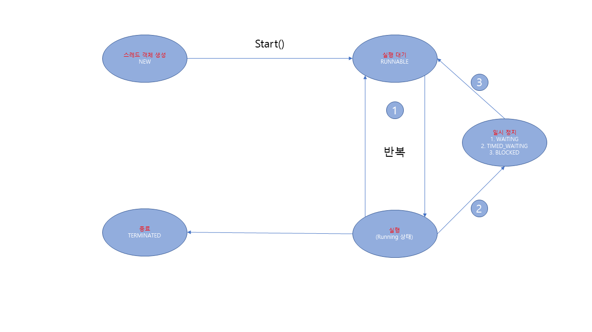

10주차 과제
==

목표
자바의 멀티쓰레드 프로그래밍에 대해 학습하세요.

## Thread 클래스와 Runnable 인터페이스
* 쓰레드(Thread)란?
    - 동작하고 있는 프로그램을 프로세스(Process)라고 한다. 보통 한 개의 프로세스는 한 가지의 일을 하지만, 이 쓰레드를 이용하면 한 프로세스 내에서 두 가지 또는 그 이상의 일을 동시에 할 수 있게 된다.
    
    ```java
        public class ThreadTest extends Thread {
            private int index;
        
            public ThreadTest(int index) {
                this.index = index;
            }
        
            @Override
            public void run() {
                super.run();
                System.out.println("Thread Run!! index : " + this.index);
                try {
                    // 1초간 대기
                    Thread.sleep(1000);
                }catch (Exception e) {
                    e.printStackTrace();
                }
                System.out.println("Thread End!! index : " + this.index);
            }
        }
        
        public class Main {
            public static void main(String[] args) {
                for(int i = 0; i < 10; i++){
                    ThreadTest threadTest = new ThreadTest(i);
                    threadTest.start();
                }
                System.out.println("종료");
            }
        }
    ```    

* Runnable란?
    - 보통 쓰레드 객체를 만들 때 위의 예처럼 Thread를 상속하여 만들기도 하지만 보통 Runnable 인터페이스를 구현하도록 하는 방법을 많이 사용한다.

    ```java
        public class RunnableTest implements Runnable {
            private int index;
        
            public RunnableTest(int index) {
                this.index = index;
            }
        
            @Override
            public void run() {
                System.out.println("Thread Run!! index : " + this.index);
                try {
                    // 1초간 대기
                    Thread.sleep(1000);
                }catch (Exception e) {
                    e.printStackTrace();
                }
                System.out.println("Thread End!! index : " + this.index);
            }
        }
  
        public class Main {
            public static void main(String[] args) {
                for(int i = 0; i < 10; i++){
                    Thread thread = new Thread(new RunnableTest(i));
                    thread.start();
                }
                System.out.println("종료");
            }
        }  
    ```    

[출처 : https://wikidocs.net/230]
## 쓰레드의 상태
* getState() 메서드를 사용하여 상태를 확인


|상태|열거 상수|설명|
|---|---|---|
| 객체 생성| NEW | 스레드 객체가 생성, 아직 start() 메소드가 호출되지 않은 상태 |
| 실행 대기 | RUNNABLE | 실행 상태로 언제든지 갈 수 있는 상태 |
| 일시 정지 | WAITING | 다른 스레드가 통지할 때까지 기다리는 상태 |
| 일시 정지 |TIMED_WAITING | 주어진 시간 동안 기다리는 상태 |
| 일시 정지 |BLOCKED | 사용하고자 하는 객체의 락이 풀릴 때까지 기다리는 상태 |
| 종료 | TERMINATED | 실행을 마친 상태 |




```java
public class ThreadTest extends Thread {
    private TargetThread targetThread;

    public ThreadTest(TargetThread targetThread) { this.targetThread = targetThread; }

    @Override
    public void run() {
        while(true) {
            Thread.State state = targetThread.getState(); // 스레드 상태 얻기
            System.out.println("타겟 스레드 상태: " + state);

            // 객체 생성 상태일 경우 실행 대기 상태로 만듬
            if(state == Thread.State.NEW) { targetThread.start(); }

            // 종료 상태일 경우 while문을 종료함
            if(state == Thread.State.TERMINATED) {
                break;
            }

            try {
                // 1.5초간 대기
                Thread.sleep(1500);
            } catch (Exception e) {
                e.printStackTrace();
            }
        }
    }
}

public class TargetThread extends Thread {

    @Override
    public void run() {
        for (int i = 0; i < 100000; i++) {
            for (int a = 0; a < 10000; a++) {
                for (int b = 0; b < 10000; b++) {
                }
            }
        }
        try {
            // 1.5초간 대기
            Thread.sleep(1500);
        } catch (Exception e) {
            e.printStackTrace();
        }
        for (int i = 0; i < 100000; i++) {
            for (int a = 0; a < 10000; a++) {
                for (int b = 0; b < 10000; b++) {
                }
            }
        }
    }
}

public class Main {
    public static void main(String[] args) {
        ThreadTest thread = new ThreadTest(new TargetThread());
        thread.start();
    }
}
```

[출처 : https://widevery.tistory.com/27]
## 쓰레드의 우선순위
* 쓰레드의 우선순위란?
    - 멀티 스레드는 동시성(Concurrency) 또는 병렬성(Parallelism)으로 실행된다. 동시성은 멀티 작업을 위해 하나의 코어에서 멀티 스레드가 번갈아가며 실행하는 성질을 말하고, 병렬성은 멀티 작업을 위해 멀티 코어에서 개별 스레드를 동시에 실행하는 성질을 말한다.
      스레드의 개수가 코어의 수보다 많을 경우, 스레드를 어떤 순서에 의해 동시성으로 실행할 것인가를 결정해야 하는데, 이것을 스레드 스케줄링이라고 한다. 스레드 스케줄링에 의해 스레드들은 아주 짧은 시간에 반갈아가면서 그들의 run() 메소드를 조금씩 실행한다.
      자바의 스레드 스케줄링은 우선순위(Priority) 방식과 순환 할당 (Round-Robin)방식을 사용한다. 우선순위 방식은 우선순위가 높은 스레드가 실행 상태를 더 많이 가지도록 스케줄링하는 것을 말한다.

```java
public class ThreadTest extends Thread {
    private int index;

    public ThreadTest(int index) {
        this.index = index;
    }

    @Override
    public void run() {
        super.run();
        System.out.println("Thread Run!! index : " + this.index);
        try {
            // 1초간 대기
            Thread.sleep(1000);
        }catch (Exception e) {
            e.printStackTrace();
        }
        System.out.println("Thread End!! index : " + this.index);
    }
}

public class Main {
    public static void main(String[] args) {
        for(int i = 0; i <= 10; i++){
            ThreadTest threadTest = new ThreadTest(i);
            
            // thread 우선순위 설정
            if(i != 10) {
                threadTest.setPriority(Thread.MIN_PRIORITY);
            } else {
                threadTest.setPriority(Thread.MAX_PRIORITY);
            }
            
            threadTest.start();
        }
        System.out.println("종료");
    }
}
```

[출처 : https://deftkang.tistory.com/56]
## Main 쓰레드
 * 메인 스레드란?
    - 메인 스레드(main thread)는 main() 메소드를 실행하면 시작된다. 즉 메인 스레드는 main메소드의 코드 흐름이다.
      메인스레드가 없다면 멀티스레드가 나올 수 없다.
    - 메인 스레드는 도중에 필요에 따라 작업 스레드들을 만들어서 병렬로 코드를 실행할 수 있다. 즉 멀티스레드를 생성해서
    멀티 태스킹을 수행한다.
      
[출처 : https://gosmcom.tistory.com/19]
## 동기화
* 동기화란?
    - 자바에서 동기화란 여러 개의 스레드가 한 개의 자원을 사용하고자 할 때 해당 스레드만 제외하고 나머지는 접근을 못하도록
      막는 것입니다.
    - 자바 동기화는 synchronized 식별자로 구현하게 됩니다.
    - 변수화 함수에 사용해서 동기화 할수 있습니다.
    
```java
// 함수에 synchronized 사용
public class Main {
    public synchronized void method() {

    }
}

// 객체 변수에 synchronized 사용
public class Main {
    public static void main(String[] args) {
        Member member = new Member();
        synchronized (member) {
            member.setName("JAVA");
            member.setAge(10);

            System.out.println(member.toString());
        }
    }
}
```

[출처 : https://mainia.tistory.com/2172]<br/>
[출처 : https://coding-start.tistory.com/68]
## 데드락
* 데르락이란?
    - 데드락이란, 둘 이상의 쓰레드가 lock을 확득하기 위해 기다리는데, 이 lock을 잡고 있는 스레드도 똑같이 다른 lock을
      기다리며 서로 블록 상태에 놓이는 것을 말한다.
    - 데드락은 다수의 쓰레드가 같은 lock을, 동시에, 다른 명령에 의해, 획득하려 할 때 발생할 수 있다.
    
[출처 : https://parkcheolu.tistory.com/19]

마감일시
2021년 1월 23일 토요일 오후 1시까지.
