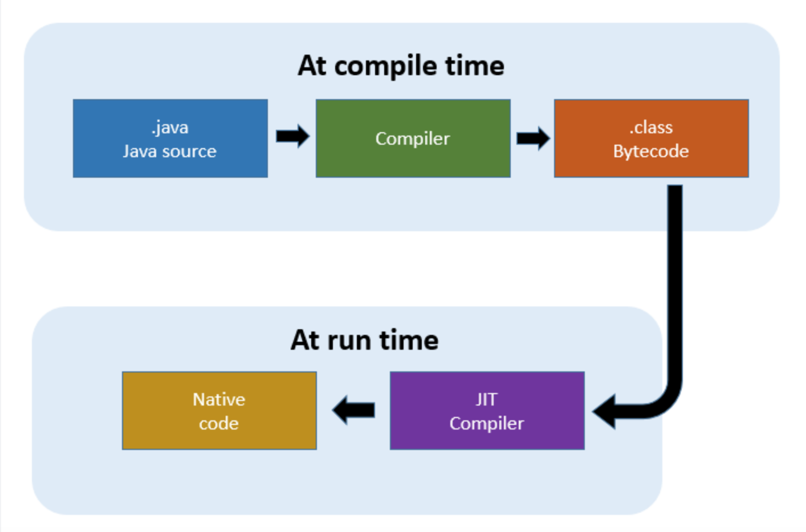

1주차 과제
==

##목표
자바 소스 파일(.java)을 JVM으로 실행하는 과정 이해하기.

<hr/>

#### JVM이란 무엇인가

* Java Virtual Machine의 약자로 '자바를 실행하기 위한 가상 기계'
* 자바 애플리케이션은 모두 JVM에서만 실행되기 때문에 자바 애플리케이션이 실행되기 위해서는 반드시 JVM이 필요하다.
* WORA(Write once, Run anywhere) JVM은 플랫폼 독립적으로 JVM이 실행 가능한 환경이라면 어디서든 Java 프로그램이 실행될 수 있도록 한다.
* ByteCode를 OS에 맞게 해석 해주는 역할을 합니다. Java compiler는 .java 파일을 .class 라는 Java byte code로 변환 시켜 줍니다. Byte Code 는 기계어가 아니기 때문에 OS에서 바로 실행되지 않습니다. 이때 JVM은 OS가 ByteCode를 이해할 수 있도록 해석 해줍니다. 하지만 JVM의 해석을 거치기 때문에 c언어 같은 네이티브 언어에비해 속도가 느렸지만 JIT(Just In Time)컴파일러를 구현해 이점을 극복했습니다.
* JVM은 OS와 상호작용을 하기 때문에 해당 OS에 맞는 JVM이 필요하다.

<br/>

#### 컴파일 하는 방법
* 자바 파일을 작성(ex: HelloStudy.java)
* javac 명령어로 자바 파일을 컴파일한다. 컴파일을 하면 .class파일이 생성이 된다.
    > ```javac HelloStudy.java```


<br/>

#### 실행하는 방법
* 컴파일로 생성괸 class파일을 java 명령어로 실행
   > ```java HelloStudy```

<br/>

#### 바이트코드란 무엇인가
* CPU가 아닌 가상 머신에서 이해할 수 있는 코드를 위한 이진 표현법이다.
* 컴파일 하면 생성되는 .class파일이 바이트코드로 구성되어 있고 명령어의 크기가 1 바이트라서 바이트코드라 불린다.
* JVM만 설치되어 있다면 바이트코드는 어떠한 운영체제에서도 실행될 수 있다.
* 역어셈블러(javap)로 해당 클래스를 실행하면 바이트코드가 출력된다.
    > ```javap HelloStudy```

<br/>

#### JIT 컴파일러란 무엇이며 어떻게 동작하는지

* Just-In-Time의 약어
* JIT 컴파일러는 두 가지의 방식을 혼합한 방식으로 생각할 수 있는데, 실행 시점에서 인터프리트 방식으로 기계어 코드를 생성하면서 그 코드를 캐싱하여, 같은 함수가 여러 번 불릴 때 매번 기계어 코드를 생성하는 것을 방지한다.




[출처 : https://neos518.tistory.com/93]


<br/>

##### JVM 구성 요소


[출처 : https://sehun-kim.github.io/sehun/JVM/]

1. Class Loader
    * 자바프로그램을 실행하면 .java파일은 컴파일러를 통해 .class(자바 바이트코드)파일로 변환된다. Class Loader는 해당 파일을 Runtime(실행)하는 시점에 Runtime Data Areas에 로딩시킨다. 즉, 컴파일하는 시점이 아니라 클래스를 처음으로 참조하는 시점(클래스의 인스턴스를 만들 때) Class Loader를 통해 메모리(Runtime Data Areas)에 로드한다
2. Runtime Data Areas
    * 런타임 데이터 영역은 JVM이 운영체제 위에서 실행될 때 할당받는 메모리 영역이다.
3. Execution Engine
    * Execution Engine 은 Class Loader를 통해 JVM 내의 Runtime Data Areas에 배치된 바이트코드를 실행한다. Execution Engine은 자바 바이트코드를 명령어 단위로 읽어서 실행한다
    * 바이트코드는 기계가 바로 수행할 수 있는 언어보다는 비교적 인간이 보기 편한 형태로 기술된 것이다. 그래서 실행 엔진은 이와 같은 바이트코드를 실제로 JVM 내부에서 기계가 실행할 수 있는 형태로 변경하며, 그 방식은 다음 두 가지가 있다.
        * Interpreter 
        * JIT(Just-In-Time) Compiler
4. GC
    * Garbage Collection은 메모리 관리를 위한 방법 중의 하나로, 프로그램이 동적으로 할당했던 메모리 영역 중에서 필요없게 된 영역[Heap]을 해제하는 기능입니다.


<br/>

#### JDK와 JRE의 차이
* JRE(Java Runtime Enviroment) : 컴파일된 자바 프로그램을 실행시킬 수 있는 자바 환경
  * JRE는 JVM이 자바 프로그램을 동작시킬 때 필요한 라이브러리 파일들과 기타 파일들을 가지고 있다.
* JDK(Java Development kit) : 자바 프로그래밍시 필요한 컴파일러 등 포함
  * JDK는 개발을 위해 필요한 도구(javac, java등)들을 포함한다.


<br/>

#### javac 옵션 조사
1. -classpath
    * 컴파일러가 컴파일 하기 위해서 필요로 하는 참조할 클래스 파일들을 찾기 위해서 컴파일시 파일 경로를 지정해주는옵션.
2. -d
    * 클래스 파일을 생성할 루트 디렉터리를 지정합니다.
      기본적으로 컴파일러는 -d옵션을 주지 않으면, 소스파일이 위치한 디렉터리에 클래스 파일을 생성시킵니다.
3. -encoding
    * 소스 파일에 사용된 문자열 인코딩을 설정합니다.
      만약 위옵션이 설정되어 있지 않으면, 플래폼의 기본적인 컨버터가 사용되어 집니다.
4. -g
    * 모든 디버깅 정보를 생성시킵니다.
      만약 위옵션이 설정되어 있지 않으면, 기본적으로, 라인넘버만 생성시킵니다.
5. -nowarn
    * 경고 메시지 (warning message)를 생성시키지 않습니다.
6. -verbose
    * 컴파일러와 링커가 현재 어느 소스파일이 컴파일되고 있고, 어느 파일이 링크되고 있는지
      그정보를 출력한다.
7. -deprecation
    * 소스 코드내에서, 사용되어진 deprecated API의 위치 를 출력 합니다.
8. -sourcepath
    * 소스파일의 위치를 지정합니다.
9. -target
    * 지정된 자바버젼의 VM에서 작동 되어지도록 클래스파일을 생성 시킵니다.
10. -bootclasspath 패스
    * 특정한 bootstrap또는 확장 클래스를 지정할수 있다.
      기본적으로, 자바컴파일러는 javac(컴파일러명령)이 설치된 플래폼의 bootstrap과 확장클래스들을 통해서, 컴파일작업을 수행하지만, bootclasspath 옵션을 사용하면, cross-compiling이라고 해서, 다른 자바플래폼의 bootstrap과 확장클래스들을 통해서, 컴파일 할수 있는 기능을 지원한다.
11. -extdirs 디렉터리
    * 특정한, 확장 디렉토리를 지정한다.cross-compiling시 주로, 사용되어지는 옵션이면, 각디렉터리들은 콜론(:)에 의해서, 분리되어진다.
      컴파일시, 기술한 디렉터리의 클래스 파일을 참조한다.

