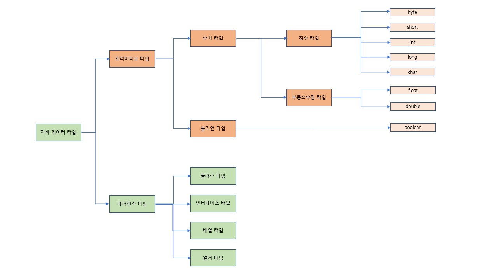

1주차 과제
==

##목표
자바의 프리미티브 타입, 변수 그리고 배열을 사용하는 방법을 익힙니다.

<hr/>

####프리미티브 타입 종류와 값의 범위 그리고 기본 값




1. 정수 타입
    * byte 
        * 1byte(8bit)
        * 기본 값 : 0
        * 데이터의 표현 범위 : -127 ~ 127
    * short
        * 2byte*(16bit)
        * 기본 값 : 0
        * 데이터의 표현 범위 : -32,768 ~ 32,767
    * int
        * 4byte(32bit)
        * 기본 값 : 0
        * 데이터의 표현 범위 : -2,147,483,648 ~ 2,147,483,647
    * long: 64bit
        * 8byte(32bit)
        * 기본 값 : 0L
        * 데이터의 표현 범위 : -9,223,372,036,854,775,808 ~ 9,223,372,036,854,775,807
    * char
        * 2byte(유니코드)(16bit)
        * 기본 값 : '\u0000' 
        * 데이터의 표현 범위 : 0 ~ 65,535
        * char는 문자형 타입이고 문자를 유니코드 형태로 사용한다.

2. 실수 타입
    * float
        * 4byte(32bit)
        * 기본 값 : 0.0F
        * 데이터의 표현 범위 : (3.4 X 10<sup>-38</sup>) ~ (3.4 X 10<sup>38</sup>) 의 근사값
        * 부동소수점 방식으로 메모리에 저장됨
    * double
        * 8byte(64bit)
        * 기본 값 : 0.0
        * 데이터의 표현 범위 : (1.7 X 10<sup>-308</sup>) ~ (1.7 X 10<sup>308</sup>) 의 근사값
        * 부동소수점 방식으로 메모리에 저장됨

3. 블리언 타입
    * boolean
        * 1byte(8bit)
        * 기본 값 : false
        * 데이터의 표현 범위 : true, false
        * 참 / 거짓 상태를 판별하기 위한 간단한 flag로 boolean을 사용합니다.
        
4. 레퍼런스 타입(Reference type)
    * 클래스 타입, 인터페이스 타입, 배열 타입, 열거 타입
    * 기본 자료 타입은 변수를 선언하면 메모리에 공간이 할당이 되지만 레퍼런스 타입은 new를 이용하여 생성하기 전까지는 메모리 공간이 할당되지 않는다.
    * 값이 저장되어 있는 곳의 주소값을 저장하는 공간으로 힙(Heap) 메모리에 저장된다.
    * 빈 객체를 의미하는 Null이 존재한다.


<br/>

####리터럴
* 리터럴
    * 리터럴은 데이터 그 자체를 뜻 한다. 변수에 넣는 변하지 않는 데이터를 의미하는 것이다.
    * ```int a = 1```<br>
        여기서 int 앞에 final을 붙이면 a는 상수가 되고, 여기서 1은 리터럴이라고 부른다.
    * 리털러 종류에는 정수, 실수, 문자, 논리, 문자열 리터럴이 있다.
    * 객체 리터럴은 데이터가 변하지 않도록 설계를 한 클래스를 불변 클래스라 칭한다.(immutable class) 해당 클래스는 한번 생성하면 객체 안의 데이터가 변하지 않는다. 변할 상황이면 새로운 객체를 만들어준다. ex) String, Color
    * 상수는 변하지 않는 변수를 의미하며(메모리 위치) 메모리 값을 변경할 수 없다. 리터럴은 변수의 값이 변하지 않는 데이터(메모리 위치안의 값)를 의미한다. 
    
    [출처: https://mommoo.tistory.com/14]


<br/>
 
####변수 선언 및 초기화하는 방법
* 변수를 선언하고 처음으로 값을 저장하는 것을 변수 초기화라고 한다.
* 멤버 변수는 초기화를 하지 않아도 변수의 타입에 맞는 기본값으로 초기화가 이루어지지만 지역 변수는 사용하기 전에 반드시 초기화가 이루어져야 한다.

멤버변수 초기화 종류
1. 명시적 초기화(explicit initialization)
    * 변수를 선언과 동시에 값을 넣어주는 것을 명시적 초기화라고 한다.
    ```
    public class Study {
        String name = "name";
        int age = 10;
        boolean attendance = false;
    }
    ```
2. 생성자(constructor)
    * 생성자는 메소드와 비슷하게 생겼지만 이름이 클래스 이름과 같고 반환형이 없다.
    * 객체를 생성할 때 new를 이용하여 호출하면 메모리 할당 후 자동으로 생성자가 불려지게 된다. 
    ```
    public class Study {
        String name;
        int age;
        boolean attendance = false;
    
        //생성자
        public Study(String name, int age, boolean attendance) {
            this.name = name;
            this.age = age;
            this.attendance = attendance;
        }
    }
   
   public static void main(String[] args) {
        Study study = new Study("name", 10, true);
   }
    ```
3. 초기화 블럭(initialization block)
    * 초기화 블럭은 아무 구문 없이 대괄호를 사용하면된다. 
    * 생성자를 호출하면 생성자가 호출되기 직전에 초기화 블럭이 호출된다.
    * 클래스 초기화 블럭, 인스턴스 초기화 블럭이 있다.
    * 클래스 변수의 초기화가 복잡하거나 인스턴스 변수의 초기화가 복잡할 경우, 또한 중복 코드를 줄이기 위해 사용된다.
    ```
   public class Study {
        String name;
        int age;
        boolean attendance = false;
    
        // 클래스 초기화 블럭
        {
            System.out.println("초기화 블럭 호출");
        }
   
        // static 초기화 블럭
        static {
            System.out.println("static 초기화 블럭 호출");
        }
    
        public Study() {
            System.out.println("생성자 호출");
        }
    }
   ```


<br/>

####변수의 스코프와 라이프타임
1. 변수의 스코프
    * 변수에 대한 접근과 변수가 존재할 수 있는 영역을 의미한다. 
    * 변수가 선언된 블럭이 그 변수의 사용범위이다.
    * 스코프 범위 내에서 같은 변수명의 중복을 방지할 수 있다.<br>
2. 변수의 라이프타임
    * 변수가 메모리에서 얼마나 오래 살아 있는지를 나타냅니다.   

3. 종류
    * 인스턴스 변수(Instance Variables)
        * Scope : 클래스의 필드로 선언하는 변수
        * Lifetime : 부모 객체를 생성할 때 생성되어 부모 객체가 가비지 컬렉션될 때 함께 삭제된다.
    * 클래스 변수(Class Variables)
        * Scope : 클래스의 static핑드로 선언한 변수
        * Lifetime : 클래스 로드시에 생성되어 클래스가 언로드되면 소멸된다.
    * 로컬 변수(Local Variables)
       * Scope : 처리 블럭 내에서만 사용할 수 있는 변수
       * Lifetime : 변수를 선언한 곳에서 생성되어 블록이 종료한 시점에서 폐기된다.


<br/>
       
####타입 변환, 캐스팅 그리고 타입 프로모션
* 캐스팅(casting)이란 타입을 변환하는 것을 말하며 형변환이라고도 한다.
* Casting은 단순히 데이터 형을 바꾸는 목적이 아니라, OOP의 특성인 다형성측면에서 활용한다.
* 타입 캐스팅(묵시적 형 변환) : 
* 타입 프로모션(명시적 형 변환) : 큰 데이터 타입에서 작은 데

1. 타입 변환 종류
    * 타입 캐스팅(묵시적 형 변환)
        * 프로그램 실행 도중에 자동으로 타입 변환리 일어난다.
        * 작은 데이터 타입에서 큰 테이터 타입으로 형 변환 되는 것
      ```
      int intValue = 10;
      double doubleValue = 2.5;
      
      // 자동 타입 변환
      doubleValue = intValue;
      ```
    * 타입 프로모션(명시적 형 변환)
        * 큰 데이터 타입에서 작은 데은 데이터 타입으로 형 변환 되는것
        * 큰 크기 타입을 작은 타입으로 자동 변환을 활 수 없다.
        * 변환 과정에서 데이터 손실이나 변형이 올 수 있다.
       ```
        int intValue = 10;
        double doubleValue = 2.5;
         
        // 강제 타입 변환
        intValue = (int) doubleValue;
       ```


<br/>

####1차 및 2차 배열 선언하기
* 동일한 자료형(Data Type)의 데이터를 연속된 공간에 나열시키고 각 데이터에 인덱스(Index)를 부여해 놓은 자료구조이다.
* 초기값 없이 배열 변수를 만들때에는 반드시 길이값이 필요하다.

* 배열 선언
    * 배열을 선언만 할 경우 배열은 null값을 가지고 있고, 이후 초기화를 하면 배열의 주소가 할당되어 사용을 할 수 있게된다.
```
    //1차원 배열
    int[] intArr1;
    int intArr2[];
    
    //2차원 배역
    int[][] intArr4;
    int intArr5[][];
```

* 배열 초기화
```
    //1차원 배열
    int[] intArr1;
    intArr1 = new int[3];
    int[] intArr2;
    intArr2 = new int[]{1, 2, 3};

    //2차원 배역
    int[][] intArr3;
    intArr3 = new int[3][3];
    int[][] intArr4;
    intArr4 = new int[][]{{1, 2, 3}, {4, 5, 6}, {7, 8, 9}};
```

* 배열 선언 및 초기화
```
    //1차원 배열
    int[] intArr1 = new int[10];
    int []intArr2 = {1, 2, 3, 4};
    
    //2차원 배역
    int[][] intArr3 = new int[5][5];
    int [][]intArr4 = {{1, 2, 3}, {4, 5, 6}, {7, 8, 9}};
```


<br/>

####타입 추론, var
* Java 10에서 var라는 Local Variable Type-Inference 가 추가되었다.
* 타입 추론이란 코드 작성 당시 타입이 정해지지 않았지만, 컴파일러가 그 타입을 유추하는 것이다.
    ```
    var message = "문자열 입니다.";
    ```
* 자바 7에서 다이아몬드 연산자라는 방식이 추가되었는데, 자바 10에서 나온 var 와 함께 사용하게 되면 컴파일 에러가 발생한다.
    ```
    var messages = new ArrayList<>();
    
    ```