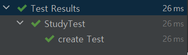
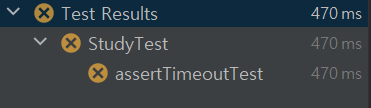
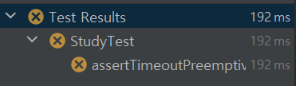

4주차 과제
==

##목표
자바가 제공하는 제어문을 학습하세요.

학습할 것
선택문
반복문

#### 선택문

* if문 이란?
  - 조건문은 예를 들어 주머니에 10000원 이상이 있으면 택시를 타고 가고, 아니면 걸어간다 처럼
    조건문을 통해 코드를 조건에 따라 코드의 실행 흐름을 다르게 동작하도록 제어하는 것이라고 할 수 있다.
  - 조건문의 종류로는 if문과 switch문이 있다.


* if문 구조
  - 조건식이 TRUE일 경우 'if문' 블록안에 있는 실행문이 실행이 되고 FALSE일 경우 'else문' 블록안에 있는 실행문이 실행된다.
  ```
    if(조건식) {
      실행문;
      실행문;
    } else {
      실행문;
      실행문;
    }  
  ```
  
  - 'if문'과 'else문' 외에 'else if문'이라고 조건문에서 FLASE일 경우 다른 조건문을 실행하여 TRUE일 경우 'else if문' 블록에
  있는 실행 문을 실행 시킨다. 참고로 else문이 제일 마지막에 나와야 한다.
  ```
    if(조건식) {
        실행문;
        실행문;
    } else if(조건문) {
      실행문;
      실행문;
    } else {
      실행문;
      실행문;
    }
  ```

* if문 예제
  ```
    public static void main(String[] args) {
        int score = 76;
    
        if (score >= 90 && score <= 100) {
            System.out.println("A학점 입니다.");
        } else if (score >= 80 && score <= 89) {
            System.out.println("B학점 입니다.");
        } else if (score >= 70 && score <= 79) {
            System.out.println("C학점 입니다.");
        } else if (score >= 60 && score <= 70) {
            System.out.println("D학점 입니다.");
        } else {
            System.out.println("F학점 입니다.");
        }
    }
  ```

- switch 란?
  - switch문의 장점은 비교하고자 하는 조건의 값이 많을 경우 유용하다.
  - 보조 제어문으로 break, continue가 있다.
  

- switch 구조
  ```
    switch(변수) {
      case 값:
        실행문;
        break;
  
      default:
        실행문;
        break;
    }
  ```

- switch문 예제

  ```
    public static void main(String[] args) {
        int score = 76;

        switch (score/10) {
            case 10:
            case 9:
                System.out.println("A학점 입니다.");
                break;
            case 8:
                System.out.println("B학점 입니다.");
                break;
            case 7:
                System.out.println("C학점 입니다.");
                break;
            case 6:
                System.out.println("D학점 입니다.");
                break;
            default:
                System.out.println("F학점 입니다.");
                break;
        }
    }
  ```


#### 반복문

* 반복문 이란?
  - 반복문은 실행문을 정해진 횟수나 값이 참이 나올때까지 반복하여 수행 할때 사용된다.
  - do while문은 무족건 한번은 수행이 되는것을 보장한다.
  - while문, do while문은 조건이 종료되는 조건을 넣지 않으면 무한루프가 된다.

- for문
  ```
    public static void main(String[] args) {
       for (int i = 1; i<= 10; i++) {
           System.out.println(i+"번째");
       }
    }
  ```
- while문
  ```
    public static void main(String[] args) {
        int i = 1;
        while (i <= 10) {
            System.out.println(i + "번째");
            i++;
        }
    }
  ```
- do while문
  ```
    public static void main(String[] args) {
        int i = 1;
        do {
            System.out.println(i + "번째");
            i++;
        } while (i <= 10);
    }
  ```

#### 과제 0. JUnit 5 학습하세요.
인텔리J, 이클립스, VS Code에서 JUnit 5로 테스트 코드 작성하는 방법에 익숙해 질 것.
이미 JUnit 알고 계신분들은 다른 것 아무거나!
더 자바, 테스트 강의도 있으니 참고하세요~

### 기본 어노테이션
- @Test
- @BeforeAll
  - annotation 이 달린 메서드가 현재 클래스의 모든 테스트 메서드보다 먼저 실행된다.
- @AfterAll
  - annotation 이 달린 메서드가 현재 클래스의 모든 테스트 메소드보다 이후에 실행된다.
- @BeforeEach
  - annotation 이 달린 메서드가 각 테스트 메서드 전에 실행된다.
- @AfterEach
  - annotation 이 달린 메서드가 각 테스트 메서드 이후에 실행된다.
- @Disabled
  - 테스트 클래스 또는 메서드를 비활성화할 수 있다.

* 기본 어노테이션 예제

  ```
    class StudyTest {
      @Test
      void create1() {
          System.out.println("create1");
      }
  
      @Test
      void create2() {
          System.out.println("create2");
      }
  
      @BeforeAll
      static void beforeAll() {
          System.out.println("before all");
      }
  
      @AfterAll
      static void afterAll() {
          System.out.println("after all");
      }
  
      @BeforeEach
      void beforeEach() {
          System.out.println("beforeEach");
      }
  
  
      @AfterEach
      void afterEach() {
          System.out.println("afterEach");
      }
  }
  
  ```

* 기본 어노테이션 출력
  ```
    before all
    beforeEach
    create1
    afterEach
    beforeEach
    create2
    afterEach
    after all
  ```


### 테스트 이름 표기
- @DisplayNameGeneration
  - 클래스에 해당 애노테이션을 붙이면 @Test 메소드 이름에 _로 표시한 모든 부분은 space로 처리된다.
- @DisplayName
  - 테스트 클래스 또는 테스트 메서드의 이름을 정의할 수 있다.

  ``` 
    @DisplayNameGeneration(DisplayNameGenerator.ReplaceUnderscores.class)
    class StudyTest {
    
        @Test
        @DisplayName("create Test")
        void create_new_study() {
            System.out.println("create");
        }
    }
  ```



### Assertion
- assertEquals(expected, actual) : 실제 값이 기대한 값과 같은지 확인
  ```
    @Test
    void assertEqulasTest() {
        Study study = new Study(30);
        assertEquals(30, study.getLimit());
    } 
  ```
  
- assertNotNull(actual) : 값이 null이 아닌지 확인
  ```
    @Test
    void assertNotNullTest() {
        Study study = null;
        assertNotNull(study);
    }
  ```
  
- assertTrue(boolean) : 다음 조건이 참(true)인지 확인
  ```
    @Test
    void assertTrueTest() {
        Study study = new Study(30);
        assertTrue(study.getLimit() >= 20);
    }
  ```
- assertFalse(boolean) : 다음 조건이 거짓(false)인지 확인
  ```
    @Test
    void assertFalseTest() {
        Study study = new Study(30);
        assertFalse(study.getLimit() >= 40);
    }
  ```
  
- assertAll(executables...) : 모든 확인 구문 확인 
  ```
    @Test
    void assertAllTest() {
        Study study = new Study(30);
        assertAll(
                () -> assertEquals(30, study.getLimit()),
                () -> {
                    assertTrue(study.getLimit() >= 10);
                    assertFalse(study.getLimit() >= 40);
                }
        );
    }
  ```
  
- assertThrows(expectedType, executable) : 예외 발생 확인
  ```
    @Test
    void assertThrowsTest() {
        Assertions.assertThrows(NumberFormatException.class, () -> {
            Integer.parseInt("One");
        });
    }
  ```
  
- assertTimeout(duration, executable) : 특정 시간 안에 실행이 완료되는지 확인, 테스트 자체가 굉장히 오래걸리는 부분을 test 해야한다면 제한시간이 있는데도 모든 테스트가 끝날때 까지 기다려야하는 단점이 존재한다.
  ```
    @Test
    void assertTimeoutTest() {
        assertTimeout(Duration.ofMillis(100), () -> {
            Thread.sleep(400);
        });
    }
  ```


- assertTimeoutPreemptively(duration, executable) : 테스트를 실행하고 테스트가 timeout되는 순간 테스트를 종료시키는 메소드이다.
  ```
    @Test
    void assertTimeoutPreemptivelyTest() {
        assertTimeoutPreemptively(Duration.ofMillis(100), () -> {
            Thread.sleep(400);
        });
    }
  ```


### 조건에 따라 테스트
- assumeTrue(조건)
- assumingThat(조건, 테스트)

### 태깅과 필터링
- @Tag
  - JUnit Platform은 테스트 대상을 고를 때 이 태그를 이용한다. 메이븐을 사용할 경우 다음과 같은 설정을 사용해서 테스트에 포함하거나 제외시킬 태그를 선택할 수 있다.
  
  ```
    @Tag("tagTest")
    @Test
    void tagTest() {
      System.out.println("tagTest");
    }
  ```


### 커스텀 태그
  - JUnit 애노테이션들을 커스터마이징 할 수 있다.
  ```
    class StudyTest {
      @JavaStudyTest
      @DisplayName("스터디 만들기 fest")
      void create_java_study() {
          System.out.println("Create java Study");
      }
    }
  ```
  ```
    @Target(ElementType.METHOD)
    @Retention(RetentionPolicy.RUNTIME)
    @Test
    @Tag("javaStudyTest")
    public @interface JavaStudyTest {
    }
  ```

### 테스트 반복
- @RepeatedTest
  ```
    @DisplayName("반복 테스트")
    @RepeatedTest(value = 10, name = "{displayName}, {currentRepetition}/{totalRepetitions}")
    void repeatedTest(RepetitionInfo repetitionInfo) {
        System.out.println("test" + repetitionInfo.getCurrentRepetition() + "/" + repetitionInfo.getTotalRepetitions());
    }
  ```
- @ParameterizedTest
  - @ValueSource 
    ```
      @DisplayName("ValueSource 테스트")
      @ParameterizedTest(name = "{index} {displayName} {0}")
      @ValueSource(strings = {"언제나", "좋은", "강의", "감사합니다."})
      void parameterizedTest(String message) {
          System.out.println(message);
      }
    ```
    - SimpleArgumentConverter
    ```
      @DisplayName("SimpleArgumentConverter 테스트")
      @ParameterizedTest(name = "{index} {displayName} {0}")
      @ValueSource(ints = {10, 20, 40})
      void parameterizedTest(@ConvertWith(StudyConverter.class) Study study) {
          System.out.println(study);
      }
  
      static class StudyConverter extends SimpleArgumentConverter {
          @Override
          protected Object convert(Object source, Class<?> targetType) throws ArgumentConversionException {
              assertEquals(Study.class, targetType, "Can only convert to Study");
              return new Study(Integer.parseInt(source.toString()));
          }
      } 
    ```
  - @NullSource : 파라미터 값으로 null를 넣어줍니다.
  - @EmptySource : 파라미터 값으로 empty를 넣어줍니다.
    ```
    @ParameterizedTest
    @NullSource
    @EmptySource
    void nullEmptyStrings(String text) {
        assertTrue(text == null || text.trim().isEmpty());
    }
    ```
  - @NullAndEmptySource : 파라미터 값으로 null과 empty를 넣어줍니다. 
    ```
    @ParameterizedTest
    @NullAndEmptySource
    void nullEmptyStrings(String text) {
        assertTrue(text == null || text.trim().isEmpty());
    }
    ```
  - @CsvSource
    - ArgumentsAggregator
  ```
    @DisplayName("CsvSource Test")
    @ParameterizedTest(name = "{index} {displayName} {0}")
    @CsvSource({"30, '온라인 자바 스터디'", "40, '4주차'"})
    void parameterizedTest(@AggregateWith(StudyAggregator.class) Study study) {
        System.out.println(study);
    }

    static class parameterizedArgumentsAggregatorTest implements ArgumentsAggregator {
        @Override
        public Object aggregateArguments(ArgumentsAccessor accessor, ParameterContext context) throws ArgumentsAggregationException {
            return new Study(accessor.getInteger(0), accessor.getString(1));
        }
    } 
  ```


 #### 과제 1. live-study 대시 보드를 만드는 코드를 작성하세요.
깃헙 이슈 1번부터 18번까지 댓글을 순회하며 댓글을 남긴 사용자를 체크 할 것.
참여율을 계산하세요. 총 18회에 중에 몇 %를 참여했는지 소숫점 두자리가지 보여줄 것.
Github 자바 라이브러리를 사용하면 편리합니다.
깃헙 API를 익명으로 호출하는데 제한이 있기 때문에 본인의 깃헙 프로젝트에 이슈를 만들고 테스트를 하시면 더 자주 테스트할 수 있습니다.

```
    public static final String AUTH_TOKEN = "";
    public static final String REPOSITORY = "";

    public static void main(String[] args) throws IOException {

        // Repository 연결
        GHRepository ghRepositor = gitRepositoryConnect();

        // 전체 이슈 정보 조회
        List<GHIssue> issues = ghRepositor.getIssues(GHIssueState.ALL);

        //스터디 참여자 정보
        Map<String, Set<Integer>> studyParticipants = getStringSetMap(issues);

        //참여율 정보 표시
        display(issues, studyParticipants);
    }

    private static GHRepository gitRepositoryConnect() throws IOException {
        // Auth Token으로 git에 연결
        GitHub github = new GitHubBuilder().withOAuthToken(AUTH_TOKEN).build();

        // git Repository 정보 조회
        GHRepository ghRepositor = github.getRepository(REPOSITORY);
        return ghRepositor;
    }

    private static Map<String, Set<Integer>> getStringSetMap(List<GHIssue> issues) throws IOException {
        // 스터디 참여자 정보
        Map<String, Set<Integer>> studyParticipants = new HashMap<>();

        for (GHIssue issue : issues) {

            // 이슈 정보에 댓글 리스트 조회
            List<GHIssueComment> comments = issue.getComments();

            for (int commentNum = 0; commentNum < comments.size(); commentNum++) {
                // 이슈 정보에 댓글 정보 조회
                GHIssueComment ghIssueComment = comments.get(commentNum);

                //현재 이슈 번호
                int issueNumber = issue.getNumber();

                if (studyParticipants.containsKey(ghIssueComment.getUser().getName())) {
                    studyParticipants.get(ghIssueComment.getUser().getName()).add(issueNumber);
                } else {
                    Set<Integer> issueSet = new HashSet<>();
                    issueSet.add(issueNumber);
                    studyParticipants.put(ghIssueComment.getUser().getName(), issueSet);
                }
            }
        }
        return studyParticipants;
    }

    private static void display(List<GHIssue> issues, Map<String, Set<Integer>> participantHashMap) {
        Iterator<String> studyUserNames = participantHashMap.keySet().iterator();
        while (studyUserNames.hasNext()) {
            String studyUserName = studyUserNames.next();

            // 이슈 전체 건수
            Double issueAllCount = (double) issues.size();

            Long studyPercent = Math.round((participantHashMap.get(studyUserName).size() / issueAllCount) * 100);
            System.out.println(studyUserName + "님은 참여율은 " + studyPercent + "% 입니다.");
        }
    }
```
[참고 : https://github-api.kohsuke.org/]


#### 과제 2. LinkedList를 구현하세요.
LinkedList에 대해 공부하세요.
정수를 저장하는 ListNode 클래스를 구현하세요.
ListNode add(ListNode head, ListNode nodeToAdd, int position)를 구현하세요.
ListNode remove(ListNode head, int positionToRemove)를 구현하세요.
boolean contains(ListNode head, ListNode nodeTocheck)를 구현하세요.


#### 과제 3. Stack을 구현하세요.
int 배열을 사용해서 정수를 저장하는 Stack을 구현하세요.
void push(int data)를 구현하세요.
int pop()을 구현하세요.


#### 과제 4. 앞서 만든 ListNode를 사용해서 Stack을 구현하세요.
ListNode head를 가지고 있는 ListNodeStack 클래스를 구현하세요.
void push(int data)를 구현하세요.
int pop()을 구현하세요.
(optional) 

#### 과제 5. Queue를 구현하세요.
배열을 사용해서 한번
ListNode를 사용해서 한번.
