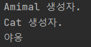

6주차 과제
==

## 자바 상속의 특징

##### 상속이란?
- 상속은 부모자 자식에게 무언가를 물려받는 것이다. 자바에서 차이라면 자식(클래스)이 상속받고 싶은 부모(클래스)를 선택해서 물려받는다.
- 상속받는 클래스를 자식 클래스, 또는 서브 클래스라고 부른다.
- 상속을 해주는 클래스를 부모 클래스, 상위 클래스 또는 슈퍼 클래스라고 한다.

```java
    // 동물 클래스
    public class Animal {
        public String sound;
    
        public String getSound() {
            return sound;
        }
    
        public void setSound(String sound) {
            this.sound = sound;
        }
    }
```
```java
    // 고양이 클래스는 동물클래스를 상속받았다.
    // 클래스 상송을 위해서는 extends라는 키워드를 사용한다.
    public class Cat extends Animal{
    }
```
```java
    public class Inheritance {
        public static void main(String[] args) {
            Animal cat = new Cat();
            cat.setSound("야옹");
            System.out.println(cat.getSound());
        }
    }
```


<br/>

##### IS-A 관계
- Cat클래스는 Animal클래스를 상속받았다. Cat은 Animal의 하위 개념이라고 할 수 있다.
  이런 경우 Cat은 Animal에 포함되기 때문에 "고양이는 동물이다."라고 표현할 수 있다.
  자바는 이러한 관계를 IS-A 관계라고 표현한다. 즉 "Cat is a Animal"과 같이 말할 수 있는 관계를 IS-A 관계라고 한다.

- IS-A관계(상속 관계)에 있을 때 자식 객체는 부모 클래스의 자료형 것처럼 사용할 수 있다.
즉, 다음과 같은 코딩이 가능하다.
```java
    Animal cat = new Cat();
```
- 부모 클래스로 ㅁ나들어진 객체를 자식 클래스의 자료형으로는 사용할 수 없다.
```java
    Cat cat = new Animal();  // 컴파일 오류
```

<br/>출처: [https://wikidocs.net/280]


<br/>

##### 상속 대상
- 자식 클래스가 부모 클래로부터 상속을 받게 되면 부모 클래스의 필스와 메서드를 물려받게 된다.
- 접근제어자가 private을 갖는 필드나 메소드는 상속이 불가하고, 패키지가 다를 경우 접근제어자가
default인 경우도 상속이 불가하다.


<br/>

##### 상속의 장점
- 중복코드를 줄일 수 있고, 유지보수가 편리하며, 통일성이 있고
- 클래스의 상속은 객체의 재사용이라는 장점 뿐만 아니라 코드의 중복을 줄일 수 있어 코드의 간결성을 제공해 준다.
- 다형성을 구현할 수 있다.


<br/>

##### 상속의 단점
- 상위 클래스 기능에 버그가 생기거나 기능의 추가/변경 등으로 변화가 생경ㅆ을 때 상위 클래스를 상속 받는 하위 클래스가 정상적으로 작동할 수 있을지에
  대한 예측이 힘듬.
- 상위 클래스에서 의미 있었던 기능이 하위 클래스에서는 의미 ㅇ벗는 기능일 수 있다.


---
## super 키워드
- 자식 클래스의 생성자에서 부모 객체의 생성자를 호출할 때 사용하는 키워드
- 자바에서 상속을 할 때 몇 가지 룰이 존재한다. 그중 하나는 바로 슈퍼 클래스의 생성자를 서브 클래스에서 반드시 불러줘야 된다는 것이다.
Aniaml클래스에 현재 기본 생성자가 있고 Cat클래스에서 super가 부모 클래스의 생성자를 부르는 콜이다.

  
```java
    public class Animal {
        private String sound;
    
        public Animal() {
            System.out.println("Amimal 생성자.");
        }
    
        public String getSound() {
            return sound;
        }
    
        public void setSound(String sound) {
            this.sound = sound;
        }
    }

```
```java
    public class Cat extends Animal{
        public Cat() {
            super();
            System.out.println("Cat 생성자.");
        }
    }
```

```java
    public class Inheritance {
        public static void main(String[] args) {
            Animal cat = new Cat();
            cat.setSound("야옹");
            System.out.println(cat.getSound());
        }
    }
```



---
## 메소드 오버라이딩(Overriding)
- 메소드 오버라이딩은 상속 관계에 있는 부모 클래스에서 이미 정의된 메소드를 자식 클래스에서
같은 시그닡쳐를 갖는 메소드로 다시 정의하는 것이다.
- 자식 클래스는 부모 클래스의 Private 멤버를 제외한 모든 메소드를 상속 받는다. 이렇게 상속받은 
메소드를 그대로 사용해도 되고, 자식 클래스에서 다시 재정의 하여 사용 하는 것을 오버라이딩이라고 한다.

```java
    public class Animal {
        private String sound;
   
        public void setSound(String sound) {
            this.sound = sound;
        }
      
        // 부모 클래스에서 정의한 cryingSound메소드
        public void cryingSound() {
            System.out.println("왈왈");
        }
    }
```

```java
  public class Cat extends Animal{
      // 자식 클래스에서 Orverriding한 cryingSound메소드
      @Override
      public void cryingSound() {
          System.out.println("야옹");
      }
  }
```

---
## 다이나믹 메소드 디스패치 (Dynamic Method Dispatch)
- Method Dispatch는 어떤 메소드를 호출할지 결정하여 실제로 실행시키는 과정을 말한다.
- 디스패치에는 Static Dispatch, Dynamic Dispatch 2가지가 있다.

##### Static Dispatch
- Static Dispatch는 컴파일 시점에서, 컴파일러가 특정 메소드를 호출할 것이라는 걸 명확하게 알고있는 경우이다.
```java
class Service {
    void run() {
        System.out.println("run()");
    }
}
```
```java
    public class StaticDispatch {
        public static void main(String[] args) {
          Service svc = new Service();
          svc.run();
        }
    }

```
##### Dynamic Dispatch
- Dynamic Dispatch는 상위 개념인 Interface 혹은 Abstract Class에서 정의된 abstract method를 호출하는 경우에 해당한다.
- 재정의 된 메서드에 대한 호출이 컴파일 타임이 아닌 런타임에 해석되는 프로세스입니다.

```java
    public abstract class Animal {
        abstract void cryingSound();
    }
```
```java
    public class Dog extends Animal{
        @Override
        public void cryingSound() {
          System.out.println("멍멍");
        }
    }
```
```java
    public class Cat extends Animal{
        @Override
        public void cryingSound() {
            System.out.println("야옹");
        }
    }
```
```java
    public class DynamicDispatch {
        public static void main(String[] args) {
            Animal cat = new Cat();
            cat.cryingSound();
        }
    }
```
- 위에 소스를 보면 Animal이라는 추상 클래스에 cryingSound()라는 메소드를 호출하고 있다. 컴파일 단계에서는 메소드를 호출하는 것만 알고 있고,
런타임 시점에 Animal에 할당된 객체가 무엇인지를 확인하고 메소드를 실행하는 것이다.

---
## 추상 클래스
- 추상 클래스란 구체적이지 않은 클래스를 의미한다.
- 추상 클래스는 클래스 앞에 abstract 키워드를 이용해서 정의한다.
- 추상 클래스는 인스턴스를 생성할 수 없다.
- 추상 클래스는 미완성의 추상 메소드를 포함할 수 있다.
  - 추상 메소드란, 내용이 없는 메소드 이다. 즉 구현이 되지 않은 메소드이다. 
  - 추상 메소드는 리턴 타입 앞에 abstract라는 키워드를 붙여야 한다.
- 상 클래스 자체로는 클래스로의 역할을 하지 못하며 객체를 생성할 수 없지만 새로운 클래스를 작성하는데 있어서 부모 클래스로서 중요한 역할을 갖는다.
- 추상 클래스에 있는 추상 메소드는 자식 클래스에게 그 구현을 강요하는 기능을 한다.
- 추상 클래스를 상속 받은 자식 클래스에서 추상 메소드를 구현하지 않았다면 자식 클래스도 추상 클래스가 되어야 한다.

```java
abstract class Animal {
    // 일반 메소드
    public void move() {
        System.out.println("움직인다.");
    } 
    abstract void cryingSound(); //추상 메소드
 
}
```
```java
    public class Cat extends Animal{
        // 추상 메소드는 자식 클래스에서 구현을 강요한다.
        @Override
        public void cryingSound() {
            System.out.println("야옹");
        }
    }
```

---
## final 키워드

##### final 변수
- 상수를 표현하기 위한 예약어 이다.
- 변수를 선언과 동시에 초기화하면 이후에 값을 수정할 수 없다.
- final 멤버 변수가 반드시 상수는 아닙니다. fianl의 정의가 '상수이다'가 아니라 '한 번만 초기화가 가능하다.'이기 때문이다.

```java
    public class Cat extends Animal{
        // fianl 선언 및 초기화
        private static final int age = 10;
        
        static final String name;
        
        //생서자를 통행 name이 초기화
        public Cat(String name) {
            this.name = name;
        }
        
        @Override
        public void cryingSound() {
            System.out.println("야옹");
        }
    }
```

##### final 메소드
- 메소드에 final이 붙으면 오버라이딩(Overriding)이 불가하다.

```java
    public class Animal {
        // 메소드에 final이 붙으면 오버라이딩이 불가하다.
        final void cryingSound(){
            System.out.println("동물의 울음소리");
        }
    }
```

##### final 클래스
- 클래스에 final이 붙으면 상속이 불가하다.
```java
    // 클래스에 final이 붙으면 상속이 불가하다.
    public final class Animal {
        void cryingSound(){
            System.out.println("동물의 울음소리");
        }
    }
```
---
## Object 클래스
- Object 클래스는 자바 API의 모든 클래스와 사용자가 정의한 모든 클래스의 최상위 클래스이다.
- 사용자가 클래스를 정의할 때 클래스 선언부에 명시적으로 Object를 지정하지 않아도 자동으로 상속받게 된다.

##### Object 클래스의 주요 메소드
|메소드|설명|
|---|---|
|boolean equals(Object obj)|두 개의 객체가 같은지 비교하여 같으면 true를, 같지 않으면 false를 반환한다.|
|String toString()|현재 객체의 문자열을 반환한다.|
|protected Object clone()|객체를 복사한다.|
|protected void finalize()|가비지 컬렉션 직전에 객체의 리소스를 정리할 때 호출한다.|
|Class getClass()|객체의 클래스형을 반환한다.|
|int hashCode()|객체의 코드값을 반환한다.|
|void notify()|wait된 스레드 실행을 재개할 때 호출한다.|
|void notifyAll()|wait된 모든 스레드 실행을 재개할 때 호출한다.|
|void wait()|스레드를 일시적으로 중지할 때 호출한다.|
|void wait(long timeout)|주어진 시간만큼 스레드를 일시적으로 중지할 때 호출한다.|
|void wait(long timeout, int nanos)|주어진 시간만큼 스레드를 일시적으로 중지할 때 호출한다.|

---
마감일시
2020년 12월 26일 토요일 오후 1시까지.
