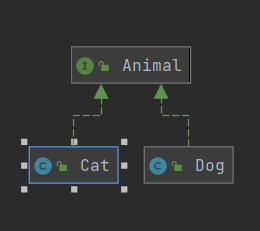

8주차 과제
==
목표
자바의 인터페이스에 대해 학습하세요.

## 인터페이스란?
* 인터페이스는 어떤 객체에 대한 명제로 이 객체가 어떤 메서드들을 제공하고 어던 역할을 하는지에 대한 일종의 설명서로 대부분 설계단계에서 만들게 됩니다.
* 인터페이스란 클래스의 일종으로 추상메서드로만 이루어진 클래스로 추상클래스에는 추상메서드와 일반 메서드가 동시에 있을 수 있다는 점에서 다릅니다.
* 추상메서드의 경우와 같이 구현부가 없는 메서드로만 구성되어 있기에 new 생성자를 사용할수 없고 그로 인해 인터페이스 안에 변수를 선언하더라도 힙메모리 안에 구성이 안되기 때문에 결국 상수로 변환됩니다.
* 구현 코드가 없는 인터페이스의 상속은 타입 상속이라고 불리기도 합니다.(하위 클래스들의 타입의 역할을 하여 다형성을 구현할 수 있게 해주기 때문에)
* 추상 클래스처럼 구현되지 않은 멤버를 포함하므로 객체화를 시킬 수 없고, 인터페이스를 상속받은 클래스에서 멤버를 구현한 뒤 자식 클래스를 객체화해 사용한다.


[출처 : https://velog.io/@foeverna/Java-%EC%9D%B8%ED%84%B0%ED%8E%98%EC%9D%B4%EC%8A%A4-%EC%9D%B8%ED%84%B0%ED%8E%98%EC%9D%B4%EC%8A%A4%EB%9E%80]


---

## 인터페이스 정의하는 방법

* 예약어로 interface를 사용하며 접근 제어자로 public or default를 사용한다.
* 인터페이스는 "~.java" 형태의 소스 파일로 작성되고 컴파일러(javac.exe)를 통해 "~.class" 형태로 컴파일되기 때문에 물리적 형태는 클래스와 동일하다.
* 

```java
public interface 인터페이스명 {

    //상수
    타입 상수명 = 값;
    
    //추상 메소드
    타입 베소드명(매개변수);

    //디폴트 메소드
    default 타입 메소드명(매개변수);

    //정적 메소드
    static 타입 메소드명(매개변수);
}
```

[출처 : https://onlyfor-me-blog.tistory.com/48]
[출처 : https://gbs1995.tistory.com/15]
[출처 : https://gbs1995.tistory.com/15]

---

## 인터페이스 구현하는 방법
* 개발 코드가 인터페이스 메소드를 호출하면 인터페이스는 객체의 메소드를 호출한다.
객체는 인터페이스에서 정의된 추상 메소드와 동일한 메소드 이름, 매개 타입, 리턴 타입을 가진 실체 메소드를 가지고 있어야 한다.
이러한 객체를 인터페이스의 구현(implement) 객체라고 하고, 구현 객체를 생성하는 클래스를 구현 클래스라고 한다.

* 구현 클래스는 보통의 클래스와 동일, 클래스 선언부에 implements 키워드를 추가하고 인터페이스명을 명시해야 한다.

* 클래스 선언부에 implements 키워드를 추가하고 인터페이스명을 명시해야 한다.

* 클래스는 상속과 달리 여러개의 인터페이스를 implements 할 수 있다.

```java
public class 구현클래스명 implements 인터페이스명 {

    //인터페이스에 선언된 추상 메소드의 실체 메소드 선언

}
```

[출처 : https://gbs1995.tistory.com/15]


```java
public interface Animal {
    void cry();
}

public class Cat implements Animal {
    @Override
    public void cry() {
        System.out.println("야옹");
    }
}

public class Dog implements Animal {
    @Override
    public void cry() {
        System.out.println("멍멍");
    }
}

public class Main {
    public static void main(String[] args) {
        Animal cat = new Cat();
        cat.cry();
    }
}

```



---

## 인터페이스 레퍼런스를 통해 구현체를 사용하는 방법

인터페이스는 객체를 생성 시킬수 없지만 인터페이스를 구현한 구현체를 객체화 시켜 사용 할 수 있습니다.
또한 구현체의 객체를 인터페이스의 형으로 캐스팅을 할 수 있습니다.

```java
public interface Animal {
    void cry();
}

public class Cat implements Animal {
    @Override
    public void cry() {
        System.out.println("야옹");
    }
    
    public void jump() {
        System.out.println("점프");
    }
}

public class Main {
    public static void main(String[] args) {
        Cat cat = new Cat();
        cat.cry();
        cat.jump();

        Animal animalCat = cat;
        animalCat.cry();
    }
}
```
---

## 인터페이스 상속

* 인터페이스도 클래스와 같이 상속을 할 수 있습니다.

* 키워드는 extends 입니다.

* 클래스의 상속과의 다른 점은 인터페이스는 여러개의 인터페이스를 상속받을 수 있다는 것입니다.

* 같은 이름이지만 리턴타입이 다른 메서드를 가진 인터페이스를 다중 상속할 수 없음. 언급했듯이 자바는 기본적으로 동일한 이름에 다른 리턴타입의 메서드를 허용하지 않음.

* 만약 상속을 받은 인터페이스 D를 구현체를 만들다면 상속 받은 인터페이스도 모두 구현을 해줘야 된다.

```java
public interface A {
    void sound();
}

public interface B {
    void move();
}

public interface C extends B {
    void hit();
}

public interface D extends A, B {
    void attack();
}

public class dImpl implements D {
    @Override
    public void sound() {

    }

    @Override
    public void move() {

    }

    @Override
    public void attack() {

    }
}
```

[출처 : https://velog.io/@youngerjesus/%EC%9E%90%EB%B0%94-%EC%9D%B8%ED%84%B0%ED%8E%98%EC%9D%B4%EC%8A%A4]
[출처 : https://joont92.github.io/java/class-interface-%EC%83%81%EC%86%8D/]
---

## 인터페이스의 기본 메소드 (Default Method), 자바 8

* 인터페이스가 default키워드로 선언되면 메소드가 구현될 수 있다. 또한 이를 구현하는 클래스는 default메소드를 오버라이딩 할 수 있다.
* 인터페이스가 변경이 되면, 인터페이스를 구현하는 모든 클래스들이 해당 메소드를 구현해야 하는 문제가 있다. 이런 문제를 해결하기 위하여 인터페이스에 메소드를 구현해 놓을 수 있도록 하였다.
```java
public interface Animal {
    void cry();

    void jump();

    default void move() {
        System.out.println("move");
    }
}

public class Cat implements Animal {
    @Override
    public void cry() {
        System.out.println("야옹");
    }

    @Override
    public void jump() {
        System.out.println("JUMP");
    }
}

public class Main {
    public static void main(String[] args) {
        Animal cat = new Cat();
        cat.cry();
        cat.jump();
        cat.move();
    }
}
```

[출처 : https://programmers.co.kr/learn/courses/5/lessons/241]
---

## 인터페이스의 static 메소드, 자바 8

* 인터페이스에 static 메소드를 선언함으로써, 인터페이스를 이용하여 간단한 기능을 가지는 유틸리티성 인터페이스를 만들 수 있게 되었다.

```java
public interface Animal {
    void cry();

    default void jump() {
        move();
        System.out.println("JUMP");
    }

    static void move() {
        System.out.println("MOVE");
    }
}

public class Cat implements Animal {
    @Override
    public void cry() {
        System.out.println("야옹");
    }
}

public class Main {
    public static void main(String[] args) {
        Animal cat = new Cat();
        cat.cry();
        cat.jump();
    }
}
```

---

## 인터페이스의 private 메소드, 자바 9

* 메소드 body가 있고 abstract이 아니다.
* static 이거나 non-static 일 수 있다.
* 구현 클래스와 인터페이스가 상속되지 않는다.
* 인터페이스에서 다른 메소드를 호출 할 수 있다.
* private는 private, abstract, default또는 static메소드를 호출 할 수 있다.
* private static은 stati 및 static private메소드만 호출 할 수 있다.


[출처 : https://flyburi.com/605]

```java
public interface Animal {
    void cry();

    default void hunt() {
        move();
        jump();
        System.out.println("Attack");
    }

    private void jump() {
        System.out.println("JUMP");
    }

    private static void move() {
        System.out.println("MOVE");
    }
}

public class Cat implements Animal {
    @Override
    public void cry() {
        System.out.println("야옹");
    }
}

public class Main {
    public static void main(String[] args) {
        Animal cat = new Cat();
        cat.cry();
        cat.hunt();
    }
}
```

---

마감일시
2021년 1월 9일 토요일 오후 1시까지.
