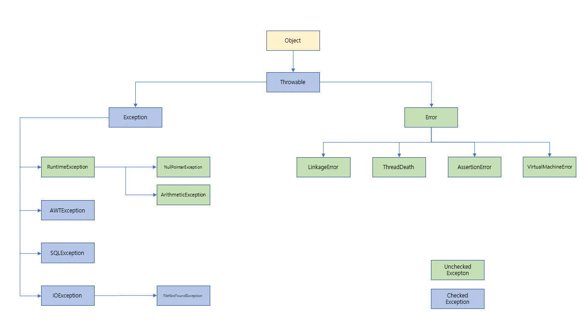

9주차 과제
==

목표
자바의 예외 처리에 대해 학습하세요.

## 자바에서 예외 처리 방법 (try, catch, throw, throws, finally)

* 예외 처리하기
  * try, catch, finally
    - try : 에러가 발생할 여지가 있는 코드를 작성
    - catch : try와 한쌍이 되서 사용되어야 하는데, try의 {...}괄호 안에서 에러가 발생하면
              해당 에러를 catch문 으로 잡아서 처리할 수가 있다. catch문은 여러 개로 사용될 수 있다.
    - finally : 사용해도 되고 안해도 되는데, 마지막에 무족건 처리할 코드가 있을 때 사용됩니다.

```java
public class Main {
    public static void main(String[] args) {
        try {
            // try영역의 문장을 실행하다 에러가 발생하면 catch로 이동
        } catch(ErrorA 1) {
            // try 영역에서 ErrorA라는 에러가 발생하면 여기로 이동 
        } catch(ErrorB 2) {
            // try 영역에서 ErrorB라는 에러가 발생하면 여기로 이동
        } finally {
            // 에러가 걸리든 안걸리든 무족건 finally영역을 실행
        }
    }
}
```

  * throw, throws
    - throw : 에러를 일부러 발생시킨다.
    - throws : 에러를 바로 처리하지 않고 나중에 처리할수 있도록 미룰 떄 사용하는 것입니다.
    
```java
public class Main {
    public static void main(String[] args) {
        try {
            throw new Exception("에러 발생");
        } catch(Exception e) {
            e.printStackTrace();
        } finally {
            System.out.println("finally 실행");
        }
    }
}
```

```java
public class Main {
    public static void main(String[] args) {
        try {
            div(12, 0);
        } catch (ArithmeticException e) {
            System.out.println("0으로는 값을 나눌 수가 없습니다.");
        }
    }
    
    public float div(int a, int b) throws ArithmeticException {
        return a / b;
    }
}
```


## 자바가 제공하는 예외 계층 구조



## Exception과 Error의 차이는?
* 오류(Error)와 예외(Exception)의 구분
    - 오류(Error)는 시스템의 비정상적인 상황이 생겼을때 발생한다. 이는 시스템 레벨에서
      발샐하기 때문에 심각한 수준의 오류이다. 따라서 개발자가 미리 예측하여 처리할 수 없기 때문에,
      애플리케이션에서 오류에 대한 처리를 신청쓰기 않아도 된다.
    - 예외(Exception)는 개발자가 구현한 로직에서 발생한다. 즉, 예회는 발생할 상황을 미리 예측하여
      처리할 수 있다. 즉, 예외는 개발자가 처리할 수 있기 떄문에 예회를 구분하고 그에 따른 처리
      방법을 명확히 알고 적용하는 것이 중요하다.
[출처 : https://www.nextree.co.kr/p3239/]
      
## RuntimeException과 RE가 아닌 것의 차이는?
계층도에서 보면 예외 클래스는 2가지 그룹으로 볼 수 있다. Exception 그룹, RuntimeException 그룹으로 나눠 볼 수 있는데
2가지를 어떻게 구분 할수 있을까?

* Checked Exception과 Unchecked(Runtime) Exception

    - Checked Exception과 Unchecked Exception의 가장 명확한 구분 기준은 '꼭 처리를 해야 하느냐'이다.
      Checked Exception이 발생할 가능성이 있는 메소드라면 반드시 로직을 try/catch로 감싸거나 throw로 던져서 처리해야 한다.
      반면에 Unchecked Exception은 명시적인 예외처리를 하지 않아도 된다. 이 예외는 치할 수 있만 개발자가 부주의 해서 발생하는 경우가
      대부분이고, 미리 예측하지 못했던 상황에서 발생하는 예외가 아니기 떄문에 굳이 로직으로 처리를 할 필요가 없더록 만들어져 있다.

    - 예회를 확인할 수 있는 시점에서도 구분할 수 있다. 일반적으로 컴파일 단계에서 명확하게 Exception체가 가능한 것을 Checked Exception이라 하며,
      실행과정 중 어떠한 특정한 논리에 의해 발견되는 Exception을 Unchecked Exception이라 한다. 따라서 컴파일 단계에서 확인할 수 없는
      예외라 하여 Unchecked Exception이며, 실행과정 중 발견된다 하여서 Runtime Exception이라 하는 것이다.

    - 예외발생시 트랜잭션의 roll-back여부이다. 기본적으로 checked Exception은 예외가 발생하면 트랜잭션은 roll-back하지 않고 예외를 건져준다.
      하지만 Unchecked Exception은 예외 발생 시 트랜잭션을 roll-back한다는 점에서 차리가 있다. 트랜잭션의 전파방식 즉, 어떻게 묶어놓으냐에 따라서
      Checked Exception이냐 Unchecked Exception이냐의 영향도가 크다. roll-back이 되는 범위가 달라지기 때문에 개발자가 이를 인지하지 못하면,
      실행결과가 맞지 않거나 예상치 못한 예외가 발생할 수 있다. 그러므로 이를 인지하고 트랜잭션을 적용시킬 때 전파방식(propagation behavior)과 롤백규칙
      등을 적절히 사용하면 더욱 요율적인 애플리케이션을 구현할 수 있을 것이다.


||Checked Exeption|Uncheked Exception|
|---|---|---|
|처리 여부|반드시 예외를 처리해야 함|명시적인 처리를 강제하지 않음|
|확인 시점|컴파일 단계|실행 단계|
|예외발생시 트랜잭션 처리|roll-back 하지 않음|roll-back 함|
|대표 예외|Exeption의 상속 받는 하위 클래스 중 Euntim Exption 제외한 모든 예외 <br/> * IOException <br/>* SQLException|  Runtime Exception 하위 예외 <br/>* NullPointerException <br/>* lliegalAgumentException <br/> * IndexOutOfBoundException <br/>* SystemException|

[출처 : https://www.nextree.co.kr/p3239/] 

## 커스텀한 예외 만드는 방법

```java
public class CustomServiceException extends Exception{
    public CustomServiceException(String message) {
        super(message);
    }
}

public class Main {
    public static void main(String[] args) {
        CustomService customService = new CustomService();
        try {
            customService.div(10, 0);
            System.out.println("실행");
        } catch (CustomServiceException e) {
            e.printStackTrace();
        }
    }
}

public class CustomService {
    public float div(int a, int b) throws CustomServiceException {
        try {
            return a / b;
        } catch (ArithmeticException e) {
            throw new CustomServiceException("0으로는 값을 나눌 수가 없습니다.");
        }
    }
}

```

마감일시
2021년 1월 16일 토요일 오후 1시까지.
